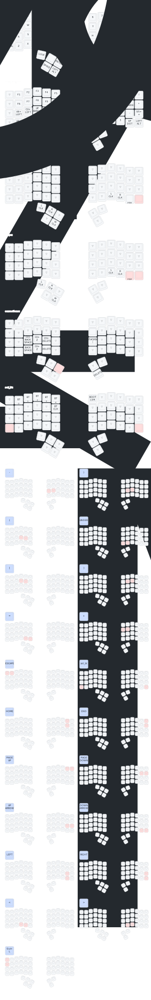

# ch-4-6-wl-nn (WHITE) — прошивка ZMK с моим кеймапом и автогенерацией SVG-схемы

Настроенная под меня версия ZMK для **Charybdis 4x6 wireless (MK1 WHITE)** с упором на:
- плавный скролл и работу мышью с клавиатуры,
- удобный доступ к цифрам/функциональным клавишам,
- макросы на русском языке,
- автогенерацию SVG-схемы раскладки и упаковку её вместе с прошивкой.

---

## Версии драйверов (config/west.yml)

- **ZMK:** `v0.3-branch` от zmkfirmware
- **Драйвер трекбола PMW3610:** `main` от inorichi ([zmk-pmw3610-driver](https://github.com/inorichi/zmk-pmw3610-driver))

---

## Ветки репозитория

- **`main`** — основная стабильная ветка для Charybdis 4x6 wireless MK1 WHITE. Содержит автогенерацию SVG-схемы и упаковку артефакта `firmware_WHT_SVG`. Используй эту ветку для повседневной прошивки.
- **`badjeff-driver`** — экспериментальная ветка с альтернативным драйвером трекбола от badjeff. Для тестирования новых возможностей.
- **`zmk-main-update`** — рабочая ветка для обновления ZMK на более новые версии и тестов. Не рекомендуется для повседневного использования без необходимости.

---

## Что в этой прошивке особенного

### Аппаратная основа

- **Клавиатура:** Charybdis 4x6 wireless  
- **Вариант:** MK1 WHITE (на ProMicro nRF52840 с трекболом PMW3610)
- **Прошивка:** ZMK, конфиг заточен под мою раскладку и привычки

### Ключевые фичи

1. **Плавный скролл и расширенная мышь**
   - Кастомное поведение `mmv_slow` для более точного управления курсором
   - Отдельный слой `auto_mouse` для кликов и скролла:
     - `&mkp LCLK`, `&mkp RCLK`, `&mkp MCLK`
     - `&msc SCRL_LEFT`, `&msc SCRL_RIGHT`
   - Отдельный слой `snipe_layer` для «снайперского» режима мыши (медленнее/точнее)

2. **Слои заточены под реальное использование**
   
   Всего 6 слоёв (лишние убраны, чтобы не раздувать раскладку):

   | # | Имя           | Что делает                                     |
   |---|---------------|-----------------------------------------------|
   | 0 | `QWERTY`      | Базовый слой, обычная работа                  |
   | 1 | `num_and_fun` | Цифры, numpad, F-клавиши, навигация           |
   | 2 | `auto_mouse`  | Автомышь — клики, скролл, SCROLLLOCK          |
   | 3 | `snipe_layer` | Точный режим мыши                             |
   | 4 | `corrections` | Коррекции текста и макросы                    |
   | 5 | `set_bt`      | Настройка Bluetooth и вход в bootloader       |

   Неиспользуемые/экспериментальные слои (`scroll`, `symbol`, `layer_8`, `layer_9`) удалены.

3. **Макросы на русском**
   
   На слое `corrections`:
   - `&phrase_proshu` — печатает «ПРОШУ ПРОЩЕНИЯ» и жмёт Enter
   - `&phrase_spasibo` — печатает «СПАСИБО!» и жмёт Enter
   - Быстрое управление: `LC(Z)`, `LC(BACKSPACE)`, `LC(DELETE)`

4. **Удобная работа с Bluetooth**
   
   На слое `set_bt`:
   - Быстрый выбор профиля: `&bt BT_SEL 0..4`
   - Очистка: `&bt BT_CLR`
   - Вход в бутлоадер: `&bootloader`

5. **SVG-схема раскладки включена в артефакты прошивки**
   
   При каждом пуше GitHub Actions:
   - парсит `config/charybdis.keymap`,
   - генерирует `keymap-drawer/charybdis.svg` и `charybdis.yaml`,
   - собирает прошивку ZMK,
   - упаковывает **UF2 + SVG** в один артефакт

   Это значит: в архиве с прошивкой всегда лежит **актуальная** схема раскладки.

---

## Артефакты GitHub Actions

После сборки в Actions появляются:

- ✅ **`firmware_WHT_SVG`** — основной артефакт: UF2-файлы + SVG-схема вместе
- 📄 **`firmware_WHT`** — только UF2-файлы
- 🎨 **`keymap_raw_files`** — сырьё от keymap-drawer (SVG + YAML)

**Для прошивки используй `firmware_WHT_SVG`** — там всё в одном месте.

---

## Быстрый старт

### 1. Скачай артефакт
- Открой вкладку **Actions** в репозитории GitHub
- Выбери последний зелёный workflow
- Скачай артефакт **`firmware_WHT_SVG`**

### 2. Распакуй архив
Внутри:
- `.uf2` файлы для левой/правой половины
- `charybdis.svg` — схема раскладки

### 3. Прошей клавиатуру
- Переведи каждую половину в режим бутлоадера (двойное нажатие reset/boot)
- Смонтируется USB-диск
- Скопируй соответствующий `.uf2` на диск
- После перезагрузки половина уйдёт в режим ZMK

### 4. Посмотри раскладку
Открой `charybdis.svg` любым просмотрщиком (браузер, VS Code, GitHub).

### 5. Как откатиться
Можно прошить назад свою старую UF2-прошивку тем же способом. Никаких необратимых изменений железу эта прошивка не делает.

---

## SVG-схема в архиве прошивки

Теперь при сборке **SVG-схема раскладки добавляется в zip-архив с UF2-файлами прошивки!**

**Преимущества:**
- Открыв `firmware_WHT_SVG.zip`, сразу видно кеймап
- Не нужно искать SVG в репозитории
- Кеймап сохраняется вместе с прошивкой

**Порядок сборки:**

1. **Генерация SVG** (`keymap_images`) → `charybdis.svg`
2. **Сборка прошивки** (`build`) → `firmware_WHT.zip`
3. **Упаковка** (`package_with_keymap`) → `firmware_WHT_SVG.zip` (с SVG внутри)

---

## Интеграция keymap-drawer и автогенерация SVG

При каждом коммите автоматически генерируется визуальная схема раскладки клавиатуры с помощью [keymap-drawer](https://github.com/caksoylar/keymap-drawer).

---

## Добавленные файлы

### 1. `.github/workflows/draw_keymaps.yaml`

**Reusable workflow** для автоматической генерации SVG-схем клавиатуры.

**Что делает:**
- Запускается при каждой сборке прошивки
- Парсит `config/charybdis.keymap`
- Генерирует `charybdis.svg` и `charybdis.yaml` в папке `keymap-drawer/`
- Автоматически коммитит изменения

**Особенности:**
- Использует `amend_commit: true` - перезаписывает последний коммит, а не создает новый
- Поддерживает west modules для ZMK
- Кастомные биндинги мыши и макросов

### 2. `keymap-drawer/config.yaml`

**Конфигурация внешнего вида** генерируемой SVG-схемы.

**Настройки:**
- **Размеры клавиш:** 60x56 px
- **Разрыв между половинами:** 30 px
- **Тема:** auto (автоматическая смена светлой/темной)
- **Комбо-диаграммы:** отдельные, масштаб x2
- **Маппинг ZMK-клавиш:** сокращенные названия

### 3. `config/charybdis.json`

**Физическое описание раскладки** Charybdis 4x6.

**Что содержит:**
- **Координаты** каждой клавиши (x, y, rotation)
- **Два layout:** `default_transform` и `charybdis_6col_layout`
- **56 клавиш:** 48 основных + 8 тамбовых (с учетом трекбола)

**Назначение:**
- Используется `keymap-drawer` для определения позиций клавиш
- Автоматически обнаруживается workflow при наличии в `config/`

---

## Измененные файлы

### `.github/workflows/main.yml`

**Основной workflow сборки прошивки и упаковки SVG-схемы вместе с UF2.**

1. **Порядок джобов:**
   - `keymap_images` запускается **первым**
   - `build` ждет `keymap_images`
   - `package_with_keymap` ждет обоих

2. **Добавлен `destination: 'both'`:**
   - SVG сохраняется и в репозиторий, и в артефакты

3. **Джоб `package_with_keymap`:**
   - Скачивает `firmware_WHT.zip`
   - Скачивает `charybdis.svg`
   - Распаковывает zip
   - Добавляет SVG в папку с UF2
   - Запаковывает обратно
   - Загружает как `firmware_WHT_SVG`

### `config/charybdis.keymap`

**Оптимизация слоев:**

Удалены неиспользуемые слои:
- ~~`scroll`~~ (layer 2)
- ~~`symbol`~~ (layer 7)
- ~~`layer_8`~~ (layer 8)
- ~~`layer_9`~~ (layer 9)

**Перенумерация ссылок:**
- `&mo 3` → `&mo 2` (auto_mouse)
- `&lt 4` → `&lt 3` (snipe_layer)
- `&lt 5` → `&lt 4` (corrections)
- `&mo 6` → `&mo 5` (set_bt)

---

## Результат

После каждого коммита в папке `keymap-drawer/` автоматически обновляются:

- **`charybdis.svg`** - визуальная схема раскладки
- **`charybdis.yaml`** - YAML-описание раскладки

### Просмотр схемы

Схему можно просматривать:
- Напрямую в GitHub: [`keymap-drawer/charybdis.svg`](keymap-drawer/charybdis.svg)
- Вставить в этот README:

```markdown

```

---

## Как работает автогенерация

### Workflow последовательность:

1. **Push/Pull Request** → запуск GitHub Actions
2. **keymap_images** → генерация SVG
3. **build** → сборка прошивки
4. **package_with_keymap** → объединение SVG + UF2

### Кастомные биндинги:

Workflow распознает кастомные ZMK-биндинги:
- **Мышь:** `&mkp LCLK`, `&mkp RCLK`, `&mkp MCLK`
- **Скролл:** `&msc SCRL_LEFT`, `&msc SCRL_RIGHT`
- **Макросы:** `&phrase_proshu` ("ПРОШУ ПРОЩЕНИЯ"), `&phrase_spasibo` ("СПАСИБО!")
- **Кастом:** `&mmv_slow` (MOUSE SLOW)

---

## Как под себя изменить визуализацию раскладки

Если хочешь настроить внешний вид SVG:

- Открой `keymap-drawer/config.yaml`
- Можно изменить:
  - размеры и форму клавиш,
  - отступ между половинами,
  - цвета и тему,
  - шрифты и размер текста,
  - маппинг длинных названий клавиш в короткие подписи

После следующего пуша в этот репозиторий:
- SVG пересоберётся автоматически,
- новый вариант попадёт в артефакт `firmware_WHT_SVG`

---

## Кредиты

Интеграция основана на [keymap-drawer](https://github.com/caksoylar/keymap-drawer) by [@caksoylar](https://github.com/caksoylar)

---

## Дополнительно

### Отключение amend_commit:

Если не хотите перезаписывать последний коммит, измените в `main.yml`:

```yaml
keymap_images:
  permissions:
    contents: write
  uses: ./.github/workflows/draw_keymaps.yaml
  with:
    amend_commit: false  # Создавать новый коммит
    destination: 'both'
```

### Изменение настроек визуализации:

Редактируйте `keymap-drawer/config.yaml` для тонкой настройки:
- Размеры клавиш
- Цветовые схемы
- Шрифты и размеры текста
- Маппинг клавиш
